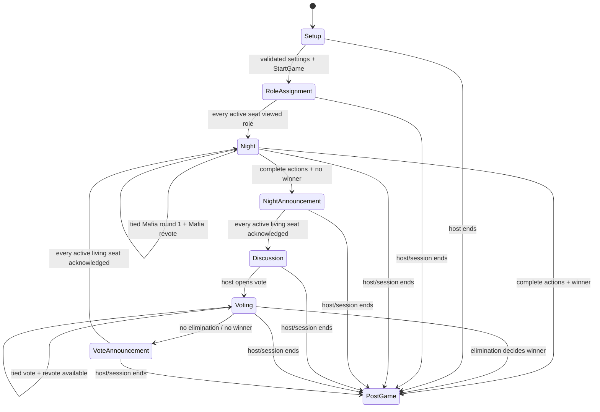

# Mafia rules and state-machine contract

Status: shipping rules contract for the `game-modes/mafia` implementation.

This document codifies the behavior enforced by `MafiaReducer`. If UI copy,
network behavior, or a test disagrees with the reducer and this document, the
disagreement is a defect to resolve explicitly; a client must not invent a
different rule.

## Session and authority

- Mafia supports 5–16 seated players.
- The host owns the canonical state and is authoritative for settings, phase
  advances, resolution, and terminal state.
- A peer may submit only actions whose `by` player is the peer identity attested
  by the session transport. Payload sender fields are not identity evidence.
- The host applies every accepted command to the same pure reducer used by
  pass-and-play. Peers never reduce gameplay speculatively.
- Player display names are labels, not authenticated human identities.

The shipping role model permits at most one Detective and at most one Doctor.
There must be at least one Mafia and one Civilian, and Mafia must begin as a
strict minority. Civilians fill all seats not assigned an explicit role.

## Roles

| Role | Team | Night action | Private information |
|---|---|---|---|
| Mafia | Mafia | Submit one kill target or skip | Other Mafia and the shared, anonymized coordination tally |
| Detective | Town | Inspect one active living player or skip | The inspected player’s Town/Mafia alignment |
| Doctor | Town | Protect one active living player or skip | Their own previous effective protection |
| Civilian | Town | Record an optional suspicion | Their latest suspicion; it has no rules effect |

By default, the Doctor cannot self-protect or protect the same player on two
consecutive nights; the Detective cannot inspect themself; a player cannot vote
for themself; and Mafia cannot target Mafia. Each option can be changed only
where represented by a validated setup setting. Even when Mafia-on-Mafia
targeting is enabled, a Mafia player cannot target themself.

## State machine

### Setup and role reveal

`StartGame` is accepted only from Setup and only when the player count and role
settings validate. Role assignment is deterministic for the session seed.
Every active seat must acknowledge its private role before night one starts.

### Night

Every active living player submits exactly one night action. A skip is an
explicit submission, not an absent action. The first valid submission is final;
duplicates and attempted replacements are no-ops.

The Detective result is derived from host-only role state when the inspection is
submitted. It is immediately available only in that Detective’s private state
and must be acknowledged before night resolution. This ordering guarantees that
the result cannot be lost if the Detective is killed that night.

`ResolveNight` is a reducer-gated host command. It is a no-op until:

1. every active living player has submitted; and
2. every pending Detective result has been acknowledged.

Mafia kill votes use plurality. With the default `REVOTE` rule, a tied first
round opens one Mafia-only coordination revote. A tied final round is resolved
deterministically from the session seed. Other supported tie settings choose a
random tied target deterministically or cause no kill.

The Doctor prevents the kill when the effective protection matches the Mafia
target. Illegal consecutive protection is rejected at submission, not silently
accepted and discarded at resolution.

### Dawn and discussion

The public dawn announcement states who died, whether a save occurred, and—when
the setup option is enabled—the dead player’s role. Every active living player
acknowledges the announcement before discussion. Discussion ends only when the
host opens voting.

### Voting

The ballot and candidate set contain active living players. Unless self-voting
is enabled, a voter cannot target themself. Each voter casts once or abstains
once; their first valid ballot action is final. Duplicate or replacement ballot
commands are no-ops.

`CloseVote` is a reducer-gated host command and is a no-op until every ballot
member has cast or abstained. A unique plurality is eliminated. A tie follows
the configured policy:

- `REVOTE_TIED_ONLY`: only tied leaders remain candidates;
- `REVOTE_ALL`: all candidates remain;
- `SKIP_ELIMINATION`: no player is eliminated.

`maxRevotes` limits additional rounds. Reaching the limit without a unique
plurality causes no elimination.

### Win and terminal state

- Town wins when no active living Mafia remain.
- Mafia wins when active living Mafia equal or outnumber active living Town.
- Otherwise there is no winner yet.

Natural wins transition immediately to PostGame. At every terminal transition,
all assigned roles become public to all peers, regardless of the
`revealRoleOnDeath` setting.

An explicit early `EndGame` evaluates the current position only if a complete
role map exists and a normal win condition is already satisfied. Otherwise the
game ends without declaring a winner; clients must render “Game ended,” never
fabricate a Town result.

## Disconnect, rejoin, and host loss

The multiplayer session coordinator—not the reducer—owns connection timers and
must pause/block gameplay while a required seat is offline. The approved
shipping policy is:

- reserve the same seat for a same-host rejoin for 120 seconds;
- accept a valid rejoin token only for that seat and session;
- show the host a confirmation-gated option to continue without the missing
  seat before the deadline;
- after the grace period, dispatch `ContinueWithoutPlayer`;
- during an active Mafia game, that action ends the game cleanly and reveals all
  roles because continuing with an absent hidden-role seat is not fair;
- host exit, host process death, or unrecoverable host loss is terminal;
- there is no host migration or spectator mode.

The reducer records disconnected seats for presentation but has no clock. The
120-second deadline, network pause, token verification, and host-loss detection
remain session-orchestration responsibilities.

## Privacy and projections

State is split into public, per-player private, and host-only buckets.

- The full role map, resolution logs, and role-assignment seed are host-only.
- A player projection contains only that player’s private bucket.
- Mafia coordination is present only for active living Mafia.
- Detective results are present only for the owning Detective.
- Night choices and suspicions are not public.
- During play, living roles are never copied into the public roster.
- In PostGame, projection derives all final public roles before erasing the
  host-only bucket.

## Determinism and command behavior

- Role assignment and tied Mafia kill resolution derive from the session seed
  and stable phase data.
- Invalid-phase, unauthorized, malformed, duplicate, already-acknowledged, and
  illegal-target actions are no-ops.
- Host close/advance commands re-check readiness in the reducer. UI button state
  is never treated as a rules boundary.
- Votes and night submissions are first-valid-write wins.

## Timers

Night, discussion, and vote duration fields remain in the serialized settings
model for compatibility, but validation rejects every non-null timer in this
release because countdown transitions are not implemented. A future timer
feature must define pause/background semantics and add reducer-visible expiry
actions before validation or production UI may enable these fields.
