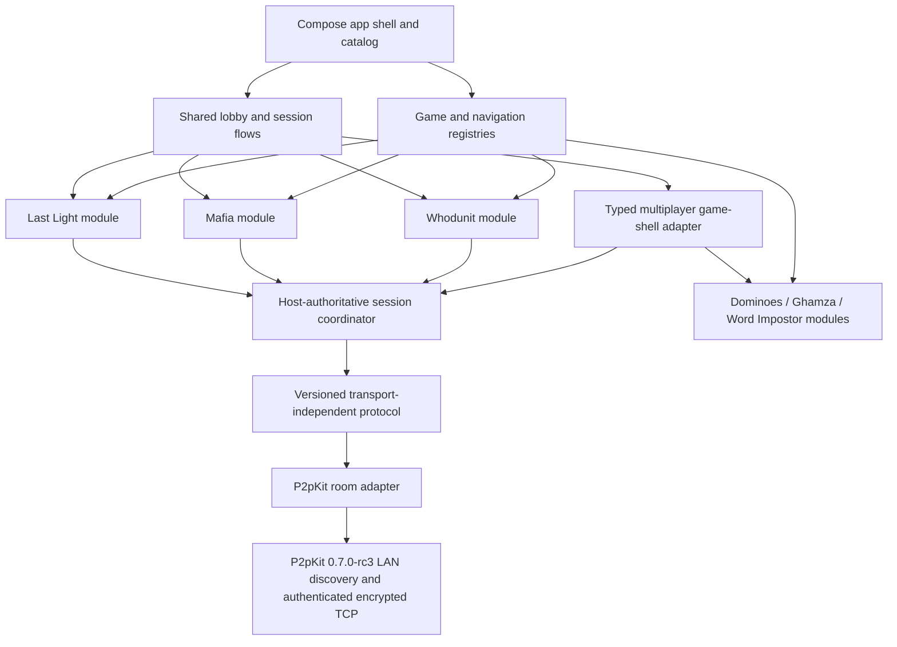
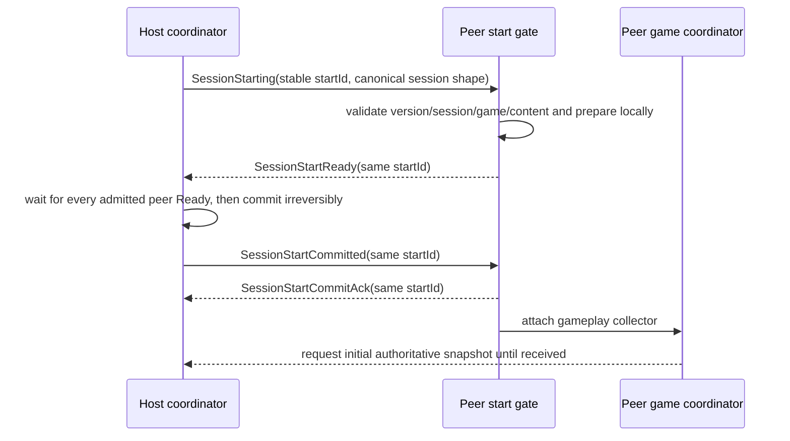
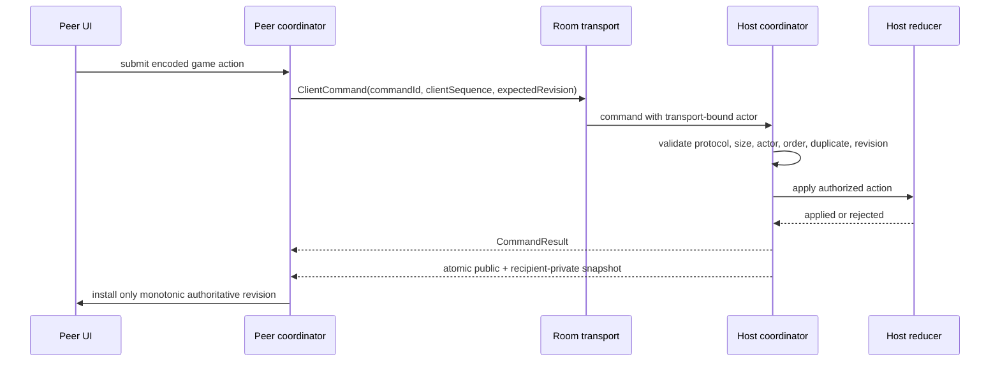
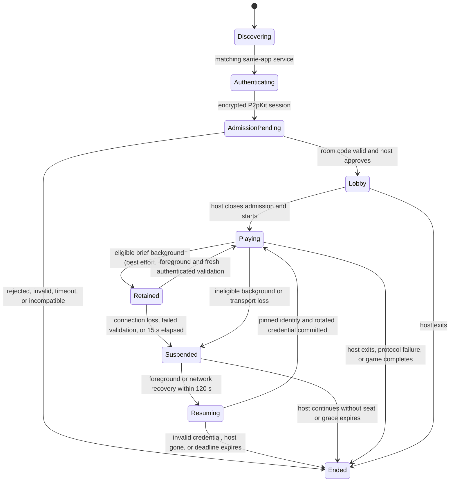

# Production architecture

This document describes the implemented architecture as of 2026-09-17.
Android and iOS are the mobile targets. Desktop also supports development and
deterministic tests; the requested [GitHub distribution](GITHUB_DISTRIBUTION.md)
channel now builds self-contained macOS/Windows/Linux installers. Signing,
physical acceptance and publication are separate gates, not implied by packaging.

## System map

Only `:shared:transport-p2p` imports P2pKit. Game modules supply rules,
serialization, projection, and authority policy; they do not own discovery,
admission, reconnect, ordering, or a P2pKit instance.

| Layer | Responsibility |
|---|---|
| `:composeApp` | Catalog, setup, permissions/privacy rationale, root navigation, DI, platform storage wiring. |
| `:shared:engine` | Generic game definitions, reducers, projections, snapshots, immutable registration. |
| `:shared:engine-testing` | Non-shipping fixture proving a second game definition can register without changing production catalogs. |
| `:shared:session` | Local controllers and the transport-independent host/peer authoritative coordinators. |
| `:shared:networking` | Protocol envelopes, validation, room contracts, admission and lifecycle events. |
| `:shared:networking-testing` | Non-shipping in-memory transport fixture for cross-module protocol and game tests. |
| `:shared:transport-p2p` | P2pKit factories, discovery, room-code admission, host approval, seat binding, reconnect, and cleanup. |
| `:game-modes:*` | A game's state/actions/events, reducer, rules, projections, codecs, screens, and bridge callbacks. |
| `:shared:storage` | Persistent settings and authenticated, platform-protected snapshots. |

## Multiplayer authority and synchronization

The host is the sole authority. Peers never run a reducer to predict canonical
state.

Runtime protocol: `4.2`.

Protocol 4.0 introduced the acknowledged, idempotent game-entry barrier;
protocol 4.1 added the canonical host display name and explicit duplicate-name
admission result. Protocol 4.2 retains both contracts and adds the host's next
expected client-command sequence to each player snapshot so a resumed peer
runtime can reclaim the retained logical seat without a false duplicate command:

The host retries the immutable offer/commit with bounded exponential backoff.
The initial Ready quorum, peer preparation, peer commit delivery, and commit
acknowledgement delivery each own a bounded 20-second phase; a control-frame
send is bounded to 2 seconds. Only `SessionStartCommitted` authorizes gameplay.
Commit acknowledgement is delivery evidence, not a rollback boundary, and a
resumed seat must replay the stable `startId` barrier before live snapshots.
During the start transaction, gameplay snapshots are not published before host
commit, and peer commands remain blocked until the peer installs a structurally
validated initial snapshot.

Protocol compatibility is strict and exact: a 4.2 binary interoperates only
with the same major and minor schema. The cross-game envelope carries protocol
version, session ID, game ID, game
version, message ID, and sequence metadata. Commands add a random command ID,
per-player client sequence, and expected host revision. The coordinator
deduplicates commands in a bounded ledger, handles sequence gaps and stale
revisions through snapshot resynchronization, bounds payloads, and treats unknown/incompatible
metadata as a closed failure rather than attempting to decode it as game data.
Each peer has at most one mutation command in flight. A stale or rejected
non-idempotent game action is never automatically replayed; the peer installs
the authoritative snapshot and the player may submit a newly validated action.
Every `PlayerSnapshot` carries `nextExpectedClientSequence`; the peer installs
it atomically with the validated public/private projection before accepting a
new command. This also makes process-recreated resume independent of an initial
intentional rejection as a sequence-resynchronization mechanism.

Admission treats the host name and every pending, connected, or resumable
logical seat name as one exact, canonical display-label namespace. A conflict
is rejected atomically with `DisplayNameInUse`; case variants remain distinct
labels, and authenticated `PlayerId` values—not names—remain the authority key.

Snapshots contain one public projection plus only the receiving player's
private slice, captured from one immutable host state. Host-only state is never
sent. Terminal state is an explicit `SessionEnded` envelope.

## Room lifecycle

Rooms are same-LAN only. P2pKit advertises the generic same-app Bonjour service;
the human room code is not advertised. A joining transport session must pass
P2pKit authenticated-v2 encryption, present the code, and receive explicit host
approval. The host binds actions to the admitted transport seat instead of
trusting a sender field from the payload. Room-code entry locates this generic
service through discovery; Parlor does not support a raw-IP/manual endpoint
fallback. See [ADR-0002](adr/0002-manual-endpoint-connection.md).

Join scheduling owns a 30-second discovery/dial/first-response deadline, a
5-second budget for each dial plus secure handshake, and candidate-local retry
with bounded backoff. WrongCode does not terminate the search while another
room candidate may appear. Once a valid request reaches `AdmissionPending`,
the host gets a separate 60-second approval window.

Rejoin is limited to the same host and seat for 120 seconds. The peer stores a
transactional credential in platform secure storage; it binds the room/game,
player, host peer ID and authenticated fingerprint, generation, and expiry.
The host stores only the secret digest in room memory. A successful resume
rotates the credential. Its cryptographic maximum age is 24 hours, but it
cannot revive a room or extend the host's 120-second disconnected-seat grace.
Explicit Leave permanently deletes it; transient disconnect, backgrounding,
and peer process death preserve it. Host process death destroys the room.

While a required seat is offline, gameplay is blocked. Terminal controls are
binding-specific: existing game bindings may offer a confirmation-gated
"continue without" action; the additional multiplayer-only bindings offer
Host Leave or the automatic 120-second expiry, not a continue-without button.
Pending expiry is cancelled atomically when the peer returns or the room ends.
Whodunit and Mafia end an active game and reveal its result rather than silently
removing a secret role. Egyptian Dominoes, Ghamza and Word Impostor abort an
incomplete round without revealing unfinished secrets or awarding points.
Each binding owns its game-specific terminal policy. There is no host migration,
spectator role, public-internet rendezvous, NAT traversal, relay, or backend
identity. Host loss after the grace period is terminal.

App lifecycle is an ordered logical-room transition, not only a P2pKit hint.
Private-content concealment remains immediate for background and inactive
interruptions. Local player commands are blocked while backgrounded and during
foreground validation. An established, healthy match may retain its existing
authenticated connections for **15 seconds, best effort**. The host stops
advertising and admitting connections immediately; only existing authenticated
peers may continue commands while the host process can execute. Lobby, pending
admission/resume transactions, unhealthy connections, or a missing session
validation owner instead suspend immediately.

Retention is not a new wire state: `RoomLifecycleState` stays Active, while
`foregroundReady` and execution-time command gates control local interaction.
A short return requires a fresh authenticated round trip within **2 seconds**
and within the original 15-second window. The host challenges every current
seat using a heartbeat echo; a peer queries a never-submitted command ID and
installs any missing authoritative revision. Pending actions are reconciled
by ID, never replayed. This uses existing protocol-4.2 messages and only
never-retired sockets; older peers without heartbeat echoes fall back safely.

Known loss, elapsed grace, or failed validation uses the existing hard
suspension/secure-rejoin path. Foregrounding inside the original **120 seconds
from first background** moves through Resuming; Active returns only after the
transport/session handoff. Repeated background events and delayed OS timers
do not extend the deadline. Host expiry performs terminal room cleanup; peer
expiry removes its local room and invalidates unusable resume state according
to the failure. This does not guarantee iOS background execution or 15 seconds
of connectivity: the OS may suspend or close networking sooner. There is no
background entitlement, foreground service, or keep-alive permission change.

Foreground peers in **every game** allow at most **1 second** for a soft native
reconnect before retiring that socket and starting pinned, credential-based
resume. They do not wait for P2pKit's entire native retry loop. A fast native
recovery keeps its socket; a retired socket cannot restore readiness. Closure
precedes replacement, the original loss/recovery deadline is retained, and no
game command is replayed. This bounds the handoff to secure recovery, not total
reconnection time; discovery and an unavailable/suspended host can still delay it.

Last Light replaces the private table with a calm, public-only recovery
surface until ready; the heading names the reconnecting host or known missing
player, and distinguishes local synchronization. It never guesses why someone
is unavailable. Leave still requires confirmation. Its per-match **Keep
screen awake** option defaults off and only prevents automatic timeout during
foreground, connected play. It releases on background/inactivity, results,
recovery, and disposal; a new match defaults off. Manual lock and app switching
remain possible. Android uses the visible view flag; iOS uses the application
idle timer, not a wake lock or background-execution mechanism.

The current authorization mode accepts an authenticated same-app P2pKit
identity and relies on room code plus host approval for admission. It encrypts
the connection and prevents payload-level peer impersonation after admission,
but it is not a real-world account or PKI identity. An active first-contact
network attacker is a residual risk until an out-of-band fingerprint or
authenticated backend trust anchor is introduced.

## Resource and diagnostics policy

Parlor bounds work above P2pKit's transport limits. Peer-to-host frames are at
most 40 KiB; host-to-peer frames are at most 272 KiB. The host application
queue holds 16 frames (at most 655,360 encoded-frame-equivalent bytes) and the
peer queue holds 8 (at most 2,228,224 bytes), plus bounded envelope overhead.
Each session permits a 32-frame burst and 16 frames/second sustained; three
violations inside the 10-second cooldown disconnect only that session.
Admission has per-peer/global token buckets, at most 17 pending requests, 21
tracked physical sessions, and 128 retained attempt identities.

Production `ParlorP2p` diagnostics use closed event/result/reason enums,
numeric sequence/elapsed fields, and coarse count buckets. The ring is 256
records; platform output has a one-record DROP_OLDEST backlog and emits at most
ten lines/second. No arbitrary strings, names, IDs, room codes, IP addresses,
fingerprints, credentials, payloads, private state, or exception messages cross
the diagnostic boundary. See `PRIVACY_AND_COMPLIANCE.md` and
`P2P_MANUAL_TEST.md`.

## Game-module contract

Each shipping game contributes:

- a stable `GameDefinition<State, Action, Event>`;
- pure reducer and validation rules;
- public, per-player-private, and host-only projections;
- versioned action and snapshot codecs;
- a `GameShellBinding` whose `definition` uses that stable game ID and owns
  catalog presentation, setup/lobby/resume entry points, and game UI;
- UI/resources and a Koin module; and
- reducer, authority, privacy, serialization, lifecycle, and full-game tests.

The composition root lists installed modules and shell bindings explicitly.
`DefaultGameRegistry` and `DefaultGameShellRegistry` reject duplicate game IDs
before routing or catalog construction. The non-shipping engine-testing fixture
registers and completes a second minimal definition, while networking-testing
supplies the in-memory transport fixture, without either entering production
catalogs. See `HOW_TO_ADD_A_GAME.md`.

The installed games are Whodunit, Mafia, Last Light, Egyptian Dominoes, Ghamza
and Word Impostor. The latter three expose Host/Join through the typed adapter in
`composeApp/shell/game/multiplayer/`; bindings supply rules/codecs/settings/UI,
while the existing coordinators remain the sole protocol and recovery owners.
The adapter's retained start/setup/action state survives route recreation.
There are no new shared-core game switches or additional transports. See
`THREE_GAMES_INTEGRATION.md` for rules, projection contracts and acceptance tests.

## Persistence, content, and diagnostics

Shipping game content is bundled and validated offline; release behavior does
not depend on a mock HTTP engine or network service. Canonical pass-and-play
resume snapshots for local-capable games are encrypted/authenticated below
`SnapshotStore` and use platform protection:
Android Keystore plus no-backup storage, iOS Keychain plus protected
Application Support files, and an owner-only desktop development key/file. Each
game supplies a versioned snapshot codec and validates its `engineVersion`
during recovery (`MafiaSnapshotRecovery.kt`, `WhodunitGameFlow.kt` and
`LastLightSnapshotRecovery.kt`). Whodunit, Mafia and Last Light support local
resume. Egyptian Dominoes, Ghamza and Word Impostor are Host/Join-only and do
not write local pass-and-play saves. Multiplayer resume is a separate
transport credential, available through every supported game binding while
the original host/seat remains valid.

Whodunit local recovery requires the exact persisted story version and canonical
content digest before starting its reducer. Missing identity metadata cannot
prove compatibility, even when a legacy save has no clues yet. Incompatible
pre-release saves stay available for Retry/Back or explicit Discard; they are
not silently rebound to edited story text. LAN start likewise requires the
exact content identity. See `PRE_RELEASE_COMPATIBILITY.md` and
`WHODUNIT_TEST_CONTENT.md` for the unpublished testing-content policy.

On iOS, legacy `Documents/snapshots` is marked excluded from backup before
listing or migrating it; failure to set or verify that flag is surfaced, not
treated as an empty store. Failed legacy migrations retain their bytes for
Retry/Discard rather than deleting the last recoverable copy. The exclusion
flag is an OS backup policy request, not proof of a completed backup/restore
test. Current records retain precedence over legacy copies even when unreadable:
an invalid header, failed authentication, unavailable key, or cancellation never
causes a silent legacy fallback. The excluded legacy copy is removed only after
successful authenticated current decryption/migration, or explicit Discard.

Settings are persistent per platform. The shipping controls are language,
theme, and reduced motion; each has a validated default. Mutations are
serialized and published to UI state only after the platform backing accepts
them. Android and Desktop surface write failures reported by their APIs; iOS
UserDefaults persists asynchronously and exposes no per-write durability
result. Last Light additionally has optional, locally played game audio;
it does not record or transmit audio. Parlor ships no analytics SDK,
crash-reporting SDK, upload provider, or placeholder consent control. Adding
any of those services is a product/privacy change that requires an implementation,
truthful UI, store disclosures, and release evidence together.

On iOS, explicit in-app language overrides carry Parlor-owned provenance in the
application preferences domain. Follow System releases only a matching owned
`AppleLanguages` value and restores its previous application-domain value or
absence, not a resolved global fallback. Unmarked legacy values and differing
external OS preference values are preserved; an identical external write cannot
be distinguished by value comparison. The marker is persisted for reconciliation
after restart, but UserDefaults still provides no per-write durability or
cross-process transaction guarantee. Language switching does not recreate active
sessions. Clean installs and current ownership-aware builds are the supported
pre-release baseline; ambiguous unmarked development-build overrides have no
supported migration (`PRE_RELEASE_COMPATIBILITY.md`). They are preserved,
not guessed away or silently deleted.

The iOS SwiftUI representable owns a plain UIKit container, with the existing
Compose controller as its single full-bounds child. This separates SwiftUI's
outer-view updates from the language provider's explicit native direction on
the Compose view. Physical edge constraints deliberately allow different
parent/child directions; safe-area padding remains Compose-owned. Standard
containment forwards appearance, while child status-bar, home-indicator,
system-edge and supported/preferred-orientation policies are delegated. There
is no second navigation stack, language-keyed root, or replacement session.
The container is implemented in Swift because the pinned Kotlin UIKit bindings
import UIViewController category methods as non-overridable extensions.
`ComposeContainerViewControllerTests` compiles that same source in the existing
Xcode UI-test target; UIKit unit assertions and actual app-host/gesture checks
are separate verification requirements.

## Release boundaries

Automated gates build/test common and Desktop code, create and lint the
unsigned Android release bundle, and link physical-device and simulator iOS
release frameworks. They do not prove signing, store configuration, physical
LAN behavior, VoiceOver/TalkBack, or App Store/Play review. Those remain dated
external receipts in `RELEASE_GATES.md`.
