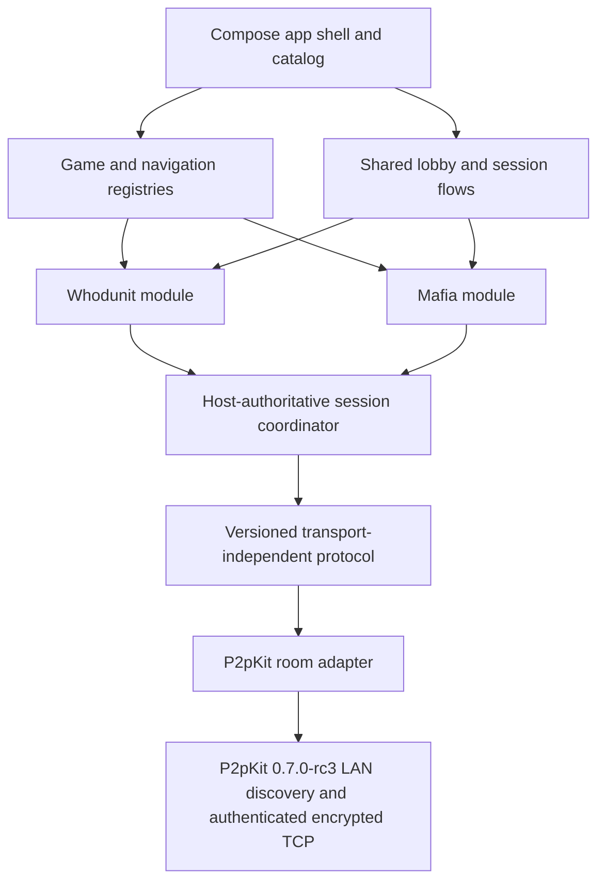
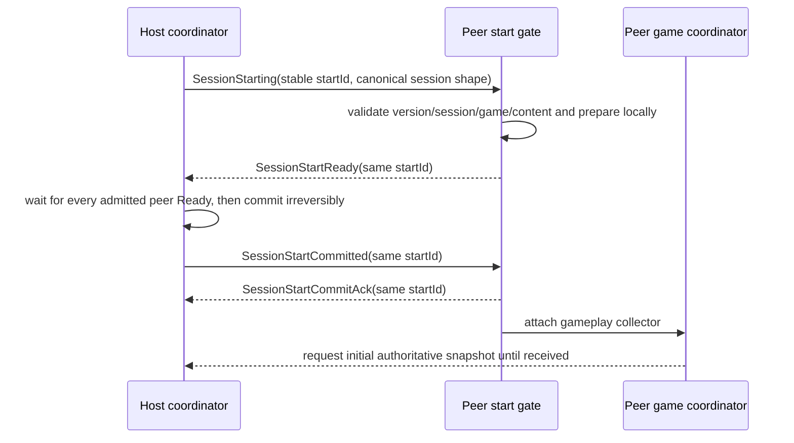
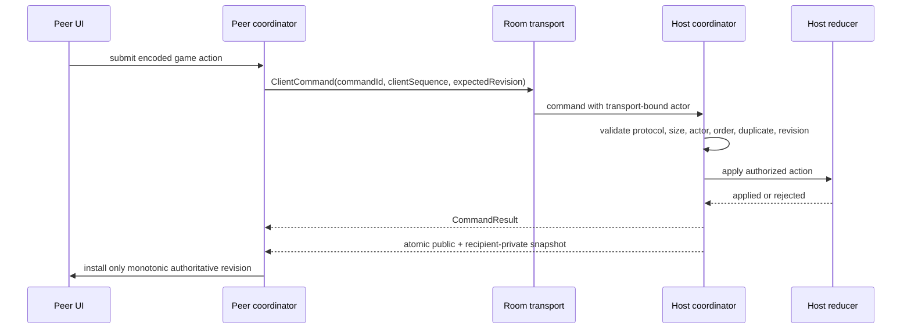
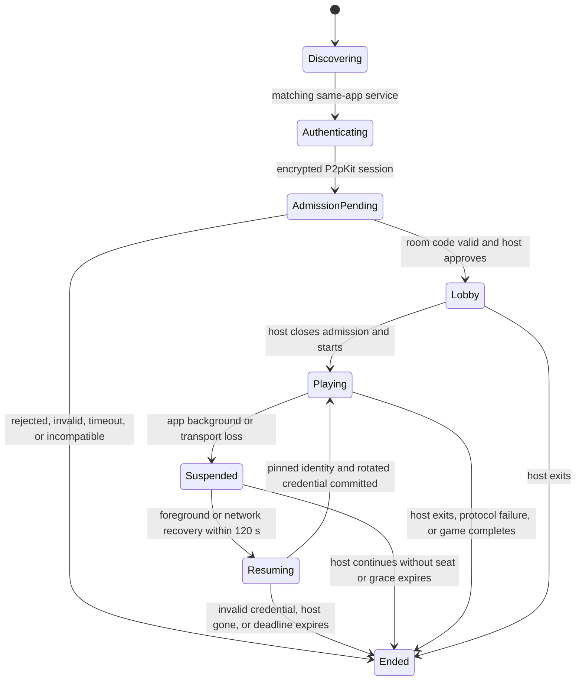

# Production architecture

This document describes the implemented production target as of 2026-08-11.
Android and iOS are shipping targets. Desktop exists for development and
deterministic tests.

## System map

Only `:shared:transport-p2p` imports P2pKit. Game modules supply rules,
serialization, projection, and authority policy; they do not own discovery,
admission, reconnect, ordering, or a P2pKit instance.

| Layer | Responsibility |
|---|---|
| `:composeApp` | Catalog, setup, permissions/privacy rationale, root navigation, DI, platform storage wiring. |
| `:shared:engine` | Generic game definitions, reducers, projections, snapshots, immutable registration. |
| `:shared:session` | Local controllers and the transport-independent host/peer authoritative coordinators. |
| `:shared:networking` | Protocol envelopes, validation, room contracts, admission and lifecycle events. |
| `:shared:transport-p2p` | P2pKit factories, discovery, room-code admission, host approval, seat binding, reconnect, and cleanup. |
| `:game-modes:*` | A game's state/actions/events, reducer, rules, projections, codecs, screens, and bridge callbacks. |
| `:shared:storage` | Persistent settings and authenticated, platform-protected snapshots. |

## Multiplayer authority and synchronization

The host is the sole authority. Peers never run a reducer to predict canonical
state.

Runtime protocol: `4.1`.

Protocol 4.0 introduced the acknowledged, idempotent game-entry barrier;
protocol 4.1 retains that barrier and additionally carries the canonical host
display name in admission/resume offers and reports duplicate display names
explicitly:

The host retries the immutable offer/commit with bounded exponential backoff.
The initial Ready quorum, peer preparation, peer commit delivery, and commit
acknowledgement delivery each own a bounded 20-second phase; a control-frame
send is bounded to 2 seconds. Only `SessionStartCommitted` authorizes gameplay.
Commit acknowledgement is delivery evidence, not a rollback boundary, and a
resumed seat must replay the stable `startId` barrier before live snapshots.
During the start transaction, gameplay snapshots are not published before host
commit, and peer commands remain blocked until the peer installs a structurally
validated initial snapshot.

Protocol compatibility is strict and exact: a 4.1 binary interoperates only
with the same major and minor schema. The cross-game envelope carries protocol
version, session ID, game ID, game
version, message ID, and sequence metadata. Commands add a random command ID,
per-player client sequence, and expected host revision. The coordinator
deduplicates commands in a bounded ledger, handles sequence gaps and stale
revisions through snapshot resynchronization, bounds payloads, and treats unknown/incompatible
metadata as a closed failure rather than attempting to decode it as game data.
Each peer has at most one mutation command in flight. A stale or rejected
non-idempotent game action is never automatically replayed; the peer installs
the authoritative snapshot and the player may submit a newly validated action.

Admission treats the host name and every pending, connected, or resumable
logical seat name as one exact, canonical display-label namespace. A conflict
is rejected atomically with `DisplayNameInUse`; case variants remain distinct
labels, and authenticated `PlayerId` values—not names—remain the authority key.

Snapshots contain one public projection plus only the receiving player's
private slice, captured from one immutable host state. Host-only state is never
sent. Terminal state is an explicit `SessionEnded` envelope.

## Room lifecycle

Rooms are same-LAN only. P2pKit advertises the generic same-app Bonjour service;
the human room code is not advertised. A joining transport session must pass
P2pKit authenticated-v2 encryption, present the code, and receive explicit host
approval. The host binds actions to the admitted transport seat instead of
trusting a sender field from the payload. Room-code entry locates this generic
service through discovery; Parlor does not support a raw-IP/manual endpoint
fallback. See [ADR-0002](adr/0002-manual-endpoint-connection.md).

Join scheduling owns a 30-second discovery/dial/first-response deadline, a
5-second budget for each dial plus secure handshake, and candidate-local retry
with bounded backoff. WrongCode does not terminate the search while another
room candidate may appear. Once a valid request reaches `AdmissionPending`,
the host gets a separate 60-second approval window.

Rejoin is limited to the same host and seat for 120 seconds. The peer stores a
transactional credential in platform secure storage; it binds the room/game,
player, host peer ID and authenticated fingerprint, generation, and expiry.
The host stores only the secret digest in room memory. A successful resume
rotates the credential. Its cryptographic maximum age is 24 hours, but it
cannot revive a room or extend the host's 120-second disconnected-seat grace.
Explicit Leave permanently deletes it; transient disconnect, backgrounding,
and peer process death preserve it. Host process death destroys the room.

While a required seat is offline, gameplay is blocked and the host gets an
explicit, confirmation-gated "continue without" action; the same lifecycle
action fires when the grace period expires. Its pending timer is cancelled
atomically when the host decides or the peer returns. For both shipping
hidden-role games, an active-game decision ends the game and reveals the
result rather than silently removing a secret role. There is no host migration,
spectator role, public-internet rendezvous, NAT traversal, relay, or backend
identity. Host loss after the grace period is terminal.

App lifecycle is an ordered logical-room transition, not only a P2pKit hint.
Backgrounding moves the room to Suspended and rejects mutation commands.
Foregrounding inside the original 120-second deadline moves through Resuming;
Active is restored only after the transport/session handoff is ready. Repeated
background events do not extend the deadline. Host expiry performs terminal
room cleanup; peer expiry removes its local room and invalidates unusable
resume state according to the failure.

The current authorization mode accepts an authenticated same-app P2pKit
identity and relies on room code plus host approval for admission. It encrypts
the connection and prevents payload-level peer impersonation after admission,
but it is not a real-world account or PKI identity. An active first-contact
network attacker is a residual risk until an out-of-band fingerprint or
authenticated backend trust anchor is introduced.

## Resource and diagnostics policy

Parlor bounds work above P2pKit's transport limits. Peer-to-host frames are at
most 40 KiB; host-to-peer frames are at most 272 KiB. The host application
queue holds 16 frames (at most 655,360 encoded-frame-equivalent bytes) and the
peer queue holds 8 (at most 2,228,224 bytes), plus bounded envelope overhead.
Each session permits a 32-frame burst and 16 frames/second sustained; three
violations inside the 10-second cooldown disconnect only that session.
Admission has per-peer/global token buckets, at most 17 pending requests, 21
tracked physical sessions, and 128 retained attempt identities.

Production `ParlorP2p` diagnostics use closed event/result/reason enums,
numeric sequence/elapsed fields, and coarse count buckets. The ring is 256
records; platform output has a one-record DROP_OLDEST backlog and emits at most
ten lines/second. No arbitrary strings, names, IDs, room codes, IP addresses,
fingerprints, credentials, payloads, private state, or exception messages cross
the diagnostic boundary. See `PRIVACY_AND_COMPLIANCE.md` and
`P2P_MANUAL_TEST.md`.

## Game-module contract

Each shipping game contributes:

- a stable `GameDefinition<State, Action, Event>`;
- pure reducer and validation rules;
- public, per-player-private, and host-only projections;
- versioned action and snapshot codecs;
- a `ModuleNavGraph` using the same stable game ID;
- UI/resources and a Koin module; and
- reducer, authority, privacy, serialization, lifecycle, and full-game tests.

The composition root lists installed modules explicitly. Duplicate game or
navigation IDs fail fast. The non-shipping engine-testing fixture registers and
completes a second minimal definition without changing session, networking, or
P2pKit adapter code. See `HOW_TO_ADD_A_GAME.md`.

## Persistence, content, and diagnostics

Shipping game content is bundled and validated offline; release behavior does
not depend on a mock HTTP engine or network service. Canonical Whodunit
pass-and-play resume snapshots are encrypted/authenticated below
`SnapshotStore` and use platform protection:
Android Keystore plus no-backup storage, iOS Keychain plus protected
Application Support files, and an owner-only desktop development key/file.
Mafia currently does not write a pass-and-play cold-start snapshot. Multiplayer
resume is a separate transport credential and is available for both shipping
games while the original host/seat remains valid.

Settings are persistent per platform. The shipping controls are language,
theme, and reduced motion; each has a validated default and a typed persistence
failure path. Parlor currently ships no sound implementation, analytics SDK,
crash-reporting SDK, upload provider, or placeholder consent control. Adding
any of those is a product/privacy change that requires an implementation,
truthful UI, store disclosures, and release evidence together.

## Release boundaries

Automated gates build/test common and Desktop code, create and lint the
unsigned Android release bundle, and link physical-device and simulator iOS
release frameworks. They do not prove signing, store configuration, physical
LAN behavior, VoiceOver/TalkBack, or App Store/Play review. Those remain dated
external receipts in `RELEASE_GATES.md`.
