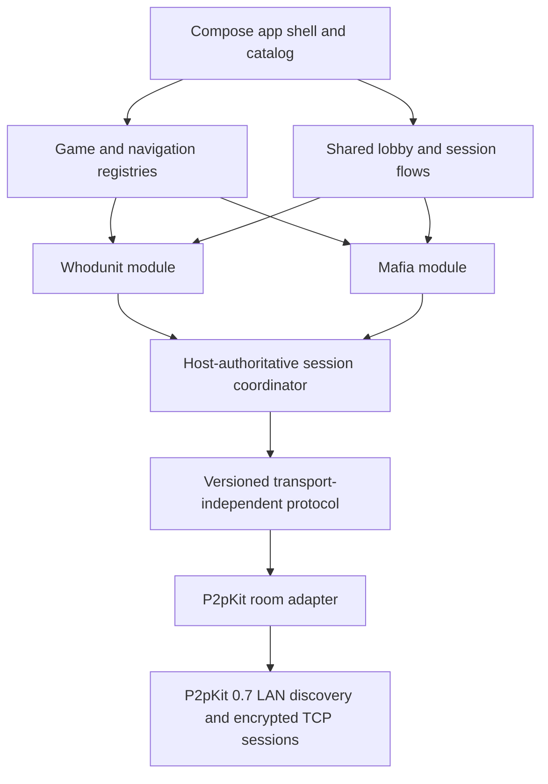
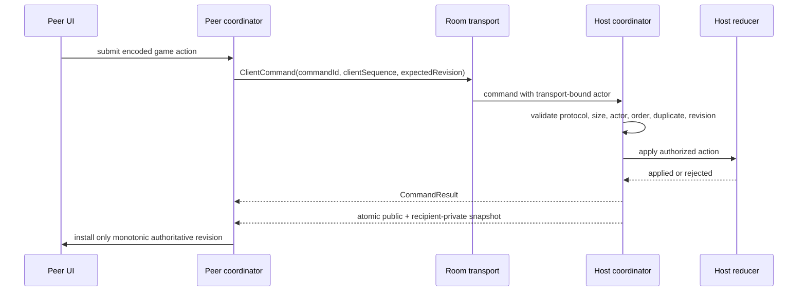
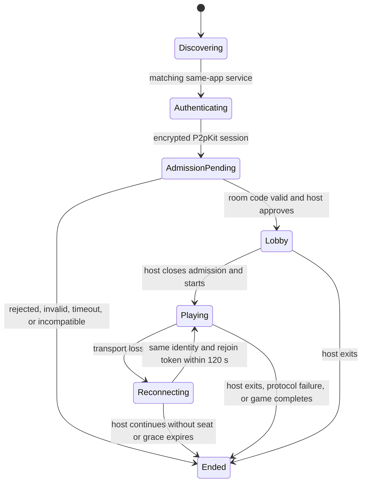

# Production architecture

This document describes the implemented production target as of 2026-07-28.
Android and iOS are shipping targets. Desktop exists for development and
deterministic tests.

## System map

Only `:shared:transport-p2p` imports P2pKit. Game modules supply rules,
serialization, projection, and authority policy; they do not own discovery,
admission, reconnect, ordering, or a P2pKit instance.

| Layer | Responsibility |
|---|---|
| `:composeApp` | Catalog, setup, permissions/privacy rationale, root navigation, DI, platform storage wiring. |
| `:shared:engine` | Generic game definitions, reducers, projections, snapshots, immutable registration. |
| `:shared:session` | Local controllers and the transport-independent host/peer authoritative coordinators. |
| `:shared:networking` | Protocol envelopes, validation, room contracts, admission and lifecycle events. |
| `:shared:transport-p2p` | P2pKit factories, discovery, room-code admission, host approval, seat binding, reconnect, and cleanup. |
| `:game-modes:*` | A game's state/actions/events, reducer, rules, projections, codecs, screens, and bridge callbacks. |
| `:shared:storage` | Persistent settings and authenticated, platform-protected snapshots. |

## Multiplayer authority and synchronization

The host is the sole authority. Peers never run a reducer to predict canonical
state.

The cross-game envelope carries protocol version, session ID, game ID, game
version, message ID, and sequence metadata. Commands add a random command ID,
per-player client sequence, and expected host revision. The coordinator
deduplicates commands, handles sequence gaps and stale revisions through
snapshot resynchronization, bounds payloads, and treats unknown/incompatible
metadata as a closed failure rather than attempting to decode it as game data.

Snapshots contain one public projection plus only the receiving player's
private slice, captured from one immutable host state. Host-only state is never
sent. Terminal state is an explicit `SessionEnded` envelope.

## Room lifecycle

Rooms are same-LAN only. P2pKit advertises the generic same-app Bonjour service;
the human room code is not advertised. A joining transport session must pass
P2pKit authenticated-v2 encryption, present the code, and receive explicit host
approval. The host binds actions to the admitted transport seat instead of
trusting a sender field from the payload.

Rejoin is limited to the same host and seat for 120 seconds. While a required
seat is offline, gameplay is blocked and the host gets an explicit,
confirmation-gated "continue without" action; the same lifecycle action fires
when the grace period expires. Its pending timer is cancelled atomically when
the host decides or the peer returns. For both shipping hidden-role games, an
active-game decision ends the game and reveals the result rather than silently
removing a secret role. There is no host migration, spectator role,
public-internet rendezvous, NAT traversal, relay, or backend identity. Host
loss after the grace period is terminal.

The current authorization mode accepts an authenticated same-app P2pKit
identity and relies on room code plus host approval for admission. It encrypts
the connection and prevents payload-level peer impersonation after admission,
but it is not a real-world account or PKI identity. An active first-contact
network attacker is a residual risk until an out-of-band fingerprint or
authenticated backend trust anchor is introduced.

## Game-module contract

Each shipping game contributes:

- a stable `GameDefinition<State, Action, Event>`;
- pure reducer and validation rules;
- public, per-player-private, and host-only projections;
- versioned action and snapshot codecs;
- a `ModuleNavGraph` using the same stable game ID;
- UI/resources and a Koin module; and
- reducer, authority, privacy, serialization, lifecycle, and full-game tests.

The composition root lists installed modules explicitly. Duplicate game or
navigation IDs fail fast. The non-shipping engine-testing fixture registers and
completes a second minimal definition without changing session, networking, or
P2pKit adapter code. See `HOW_TO_ADD_A_GAME.md`.

## Persistence, content, and telemetry

Shipping game content is bundled and validated offline; release behavior does
not depend on a mock HTTP engine or network service. Canonical Whodunit resume
snapshots are encrypted/authenticated below `SnapshotStore` and use platform
protection:
Android Keystore plus no-backup storage, iOS Keychain plus protected
Application Support files, and an owner-only desktop development key/file.
Mafia currently does not write a cold-start snapshot, so the shell does not
advertise Mafia resume; a future game must provide a game-aware snapshot
adapter before adding a Continue tile.

Settings are persistent per platform. Language, theme, reduced motion, sound,
analytics consent, and crash-reporting consent have validated defaults.
Analytics and crash reporting are separate, default-off choices. If a
consent-aware provider is not externally configured, `NoOpTelemetry` collects
nothing.

## Release boundaries

Automated gates build/test common and Desktop code, create and lint the
unsigned Android release bundle, and link physical-device and simulator iOS
release frameworks. They do not prove signing, store configuration, physical
LAN behavior, VoiceOver/TalkBack, or App Store/Play review. Those remain dated
external receipts in `RELEASE_GATES.md`.
